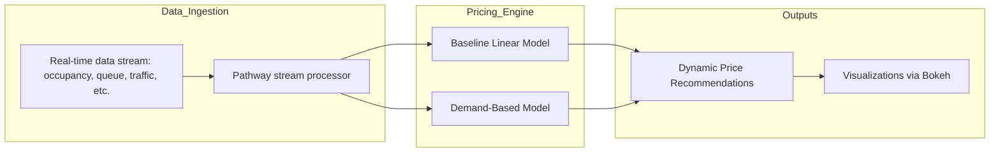
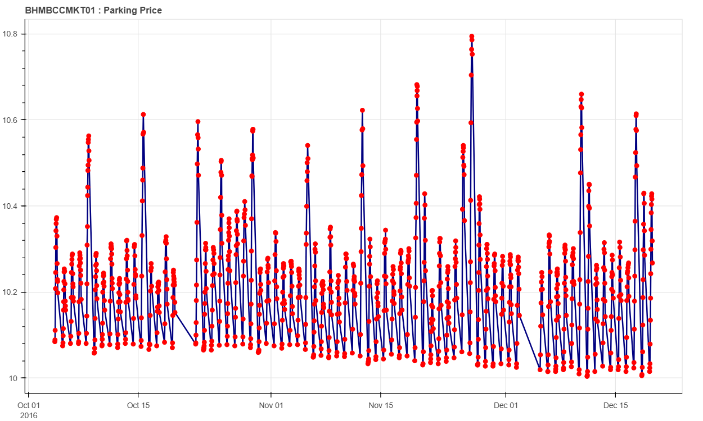

# 🅿️ Dynamic Pricing for Urban Parking Lots

This repository contains my implementation of dynamic pricing models for urban parking lots, developed as part of the **Summer Analytics 2025 Capstone Project** hosted by the **Consulting & Analytics Club × Pathway**.

The goal is to simulate a data-driven dynamic pricing system that adjusts parking fees based on real-time demand, traffic, and competitive factors. My models help optimize parking space utilization in cities by preventing overcrowding and underutilization.

## 🚀 Project Overview

Urban parking is a limited resource, and static pricing often leads to inefficiency — lots are either overfilled or empty at various times. My solution uses real-time data streams to:

- **Predict demand**
- **Adjust prices dynamically**

### Implemented Models

1. **Baseline Linear Price Function**  
   Simple price adjustment based on current occupancy rate.

2. **Demand-Based Price Function**  
   Advanced pricing using occupancy, queue length, traffic, special day indicators, and vehicle type.

---

## 🛠 Tech Stack

| Technology | Purpose |
|------------|---------|
| **Python (Pandas, Numpy)** | Data processing and model building |
| **Pathway** | Real-time data streaming and simulation |
| **Bokeh** | Real-time data visualization |
| **Google Colab** | Development environment |
| **GitHub** | Version control and collaboration |

---

## 🔍 Detailed Architecture and Workflow

- **Data Ingestion**:  
  We use **Pathway** to simulate real-time streaming of parking lot data (occupancy, queue length, traffic, special day indicators, vehicle type). Data is processed at 30-minute intervals from 8 AM to 4:30 PM.

- **Pricing Models**:
  - **Baseline Linear Model**  
    Adjusts price linearly with occupancy:
    
    Price(t+1) = Price(t) +  α · (Occupancy / Capacity)

  - **Demand-Based Model**  
    Uses weighted sum of features to compute normalized demand and update price smoothly:
    
    Demand = α·(Occupancy/Capacity) +β·QueueLength−γ·Traffic+δ·IsSpecialDay+ε·VehicleTypeWeight

    Price(t) = BasePrice · (1 + λ · NormalizedDemand) 
    
    where price is kept between 0.5× and 2× of the base price.

## 🏗️ Project Architecture

## 🔍 Visualizations

### 📊 Model 1: Baseline Linear Pricing

- This plot shows how price varies with time based on simple occupancy logic.
- The pattern is linear and directly responds to capacity changes.

---

### 📈 Model 2: Demand-Based Pricing

- This visualization reflects a more complex pricing behavior.
- It incorporates queue length, vehicle type, traffic, and special events.
- Price fluctuations are smoother and more demand-sensitive.

---

## 📄 References

- [Pathway Docs: Real-Time App](https://pathway.com/developers/user-guide/introduction/first_realtime_app_with_pathway/)
- [Summer Analytics 2025](https://www.caciitg.com/sa/course25/)
- Project problem statement (see `problem_statement.pdf`)
- Sample_Notebook.ipynb
