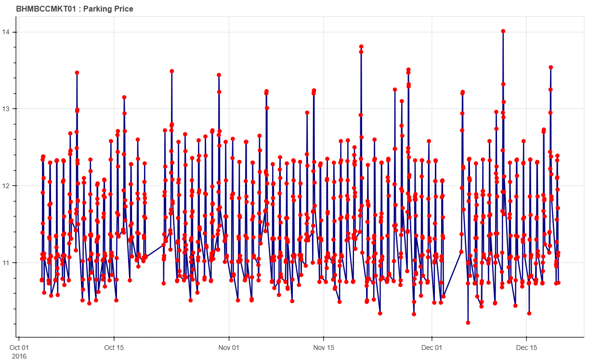

# 🅿️ Dynamic Pricing for Urban Parking Lots

This repository contains my implementation of dynamic pricing models for urban parking lots, developed as part of the **Summer Analytics 2025 Capstone Project** hosted by the **Consulting & Analytics Club × Pathway**.

The goal is to simulate a data-driven dynamic pricing system that adjusts parking fees based on real-time demand, traffic, and competitive factors. My models help optimize parking space utilization in cities by preventing overcrowding and underutilization.

## 🚀 Project Overview

Urban parking is a limited resource, and static pricing often leads to inefficiency — lots are either overfilled or empty at various times. My solution uses real-time data streams to:

- **Predict demand**
- **Adjust prices dynamically**

### Implemented Models

1. **Baseline Linear Price Function**  
   Simple price adjustment based on current occupancy rate.

2. **Demand-Based Price Function**  
   Advanced pricing using occupancy, queue length, traffic, special day indicators, and vehicle type.

---

## 🛠 Tech Stack

| Technology | Purpose |
|------------|---------|
| **Python (Pandas, Numpy)** | Data processing and model building |
| **Pathway** | Real-time data streaming and simulation |
| **Bokeh** | Real-time data visualization |
| **Google Colab** | Development environment |
| **GitHub** | Version control and collaboration |

---

## 🔍 Detailed Architecture and Workflow

- **Data Ingestion**:
 
  We use **Pathway** to simulate real-time streaming of parking lot data (occupancy, queue length, traffic, special day indicators, vehicle type). Data is processed at 30-minute intervals from 8 AM to 4:30 PM      from 14 Parking lots over 73 days.

- **Features included**:
  
  - SystemCodeNumber
  -  LastUpdatedTime
  -  LastUpdatedDay
  -  Occupancy
  -  Capacity
  -  QueueLength
  -  VehicleType
  -  TrafficCondtiotnNearby
  -  IsSpecialDay

- **Pricing Models**:
  - **Baseline Linear Model**  
    Adjusts price linearly with occupancy:
    
    Price(t+1) = Price(t) +  α · (Occupancy / Capacity)

  - **Demand-Based Model**  
    Uses weighted sum of features to compute normalized demand and update price smoothly:
    
    Demand = α·(Occupancy/Capacity) +β·QueueLength−γ·Traffic+δ·IsSpecialDay+ε·VehicleTypeWeight

    Price(t) = BasePrice · (1 + λ · NormalizedDemand) 
    
    where price is kept between 0.5× and 2× of the base price.

## 🏗️ Project Architecture

## 🔍 Visualizations

### 📊 Model 1: Baseline Linear Pricing

- This plot shows how price varies with time based on simple occupancy logic.
- The pattern is linear and directly responds to capacity changes.

---

### 📈 Model 2: Demand-Based Pricing

- This visualization reflects a more complex pricing behavior.
- It incorporates queue length, vehicle type, traffic, and special events.
- Price fluctuations are smoother and more demand-sensitive.

---

## 🧩 Assumptions

The models are based on several assumptions to simplify modeling, ensure fairness, and match real-world constraints.

---

### 🔹 General Assumptions

- **Base Price Initialization**: All models start from a fixed **base price of $10**.
- **Data Integrity**: Real-time input data (occupancy, queue, traffic, etc.) is assumed accurate and timely.
- **Lot Uniformity**: All 14 parking lots are treated uniformly in logic and constraints.
- **Bounded Price Behavior**: Prices are always constrained between **$5 and $20** to prevent erratic pricing.
- **No Historical Memory**: Models use current snapshot data; no trend or time-lag factors are incorporated.

---

### 🔹 Model 1: Baseline Linear Pricing Assumptions

- **Occupancy-Only Dependency**: Price changes proportionally to the occupancy rate.
- **Linear Relationship**:
  \[
  Price_{t+1} = Price_t + \alpha \cdot \left(\frac{Occupancy}{Capacity}\right)
  \]
- **Simplification**: Ignores other impactful features such as queue, traffic, or vehicle type.

---

### 🔹 Model 2: Demand-Based Pricing Assumptions

- **Multi-Feature Demand Function**:
  \[
  Demand = \alpha \cdot \left(\frac{Occupancy}{Capacity}\right) + \beta \cdot QueueLength - \gamma \cdot Traffic + \delta \cdot IsSpecialDay + \epsilon \cdot VehicleTypeWeight
  \]

- **Vehicle Type Mapping**:
  - Car = 1.0  
  - Bike = 0.7  
  - Truck = 1.3

- **Feature Impact Direction**:
  - Occupancy, queue length, special days → **increase demand**
  - Traffic congestion → **decreases demand**
  - Heavier vehicles → **increase demand**

- **Demand Normalization**: Demand values are scaled between 0 and 1 (Min-Max normalization).
- **Smooth Price Scaling**:
  \[
  Price_t = BasePrice \cdot (1 + \lambda \cdot NormalizedDemand)
  \]

---

---

## 📄 References

- [Pathway Docs: Real-Time App](https://pathway.com/developers/user-guide/introduction/first_realtime_app_with_pathway/)
- [Summer Analytics 2025](https://www.caciitg.com/sa/course25/)
- Project problem statement (see `problem_statement.pdf`)
- Sample_Notebook.ipynb
